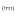

## Rolly
<h3 align="center">
     
    
    Radar core library
     
     
    
</h3>

#### Dependencies

- [**fmt**](https://github.com/fmtlib/fmt) - modern formatting library (proposal for `std::format`) (**MIT**)
- [**catch2**](https://github.com/catchorg/Catch2) - c++ testing framework (**BSL-1.0**)
- [**libuuid**](https://sourceforge.net/projects/libuuid/) - portable uuid c library (**BSD-3-Clause**)

#### Licensing

*Rolly* library is distributed under the MIT license. See [LICENSE](./LICENSE) for details.
